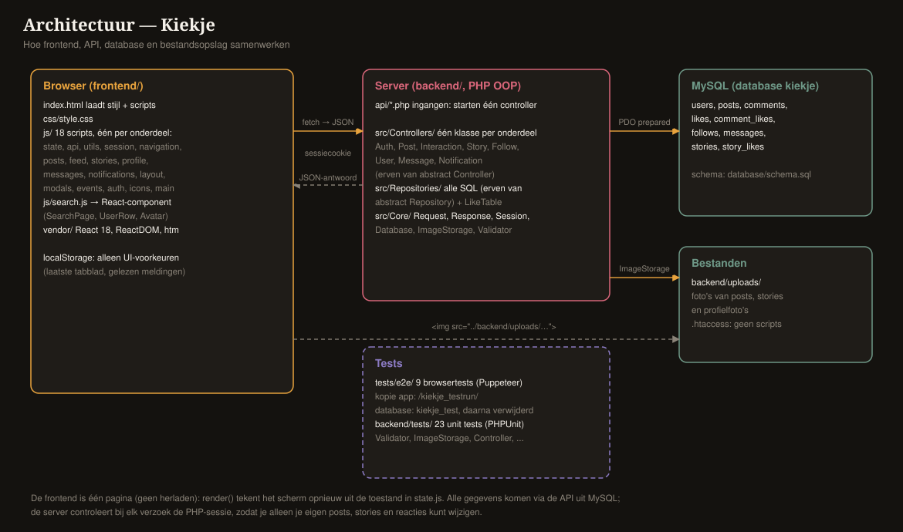
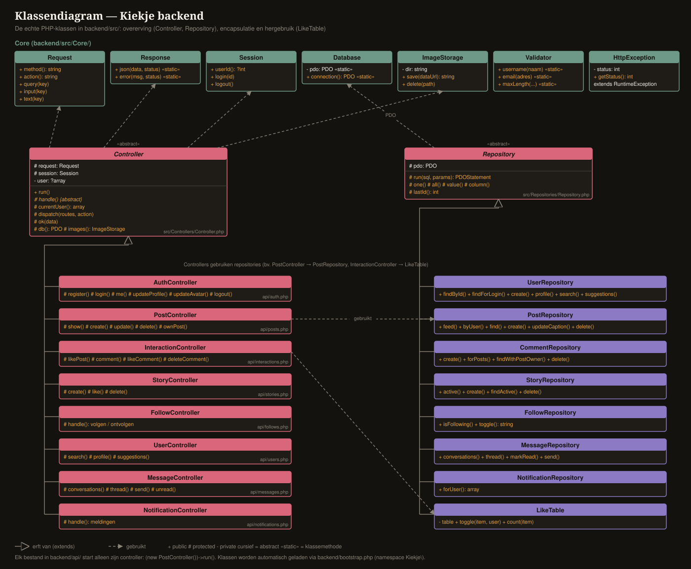
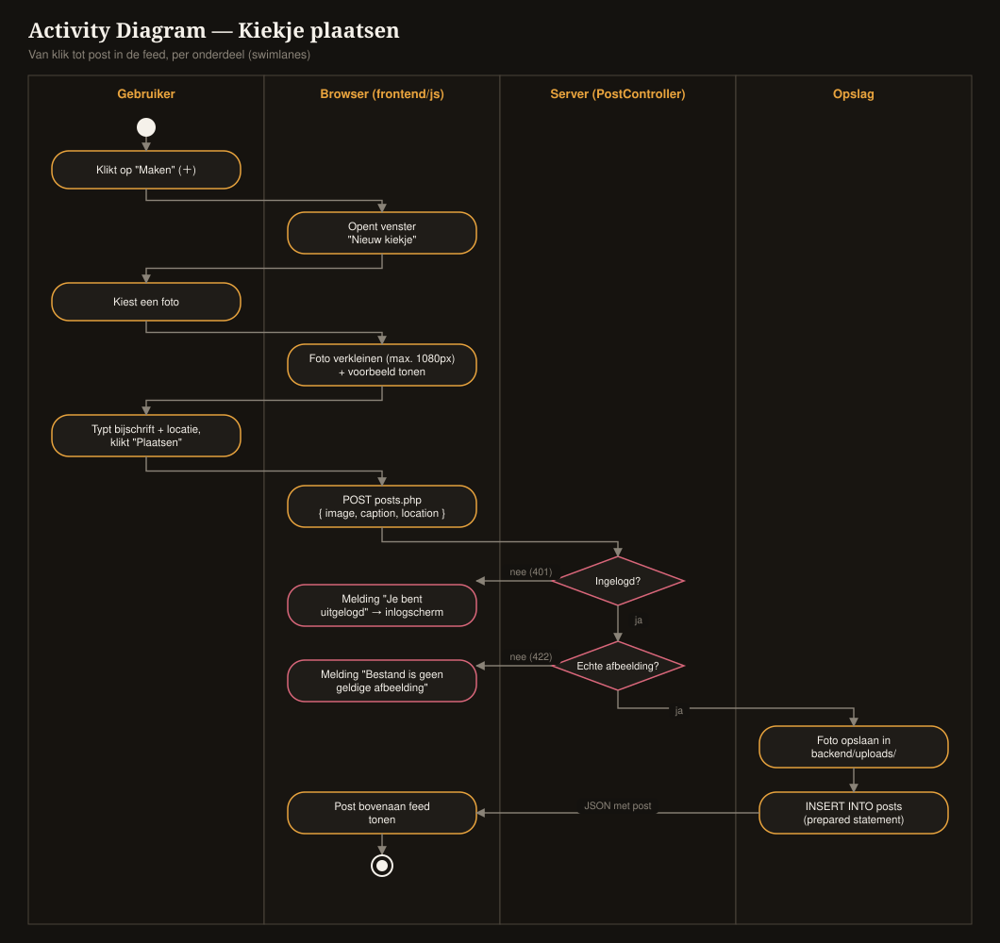

# Kiekje — architectuur

Hoe de app van binnen werkt. Zie ook [api.md](api.md) voor alle endpoints en de diagrammen in [`diagrams/`](../diagrams/).



## 1. Lagen

| Laag | Waar | Taak |
|---|---|---|
| Frontend | `frontend/` | Schermen tekenen, knoppen afhandelen, gegevens ophalen via de API |
| API | `backend/api/*.php` | Controleren (sessie, invoer, eigenaarschap), database lezen/schrijven, JSON teruggeven |
| Database | MySQL `kiekje` | Alle gegevens (9 tabellen, zie [ERD](../diagrams/erd.svg)) |
| Bestanden | `backend/uploads/` | Foto's van posts, stories en profielfoto's |

De browser bewaart zelf geen gegevens van posts of gebruikers. `localStorage` onthoudt alleen UI-voorkeuren
(laatste tabblad en welke meldingen je al gezien hebt). Daardoor ziet iedereen, in elke browser, dezelfde data.

## 2. Frontend

Kiekje is een **single-page app**: één pagina (`index.html`) die van inhoud wisselt zonder te herladen.
De scripts zijn gewone `<script>`-bestanden in een vaste volgorde en delen dezelfde globale variabelen.

### De render-cyclus

1. **Toestand** staat in `state.js`: wie is ingelogd (`me`), welk tabblad (`tab`), wat is geladen
   (`feedPosts`, `stories`, `profileData`, `notifs`, …) en welk venster open is (`modal`).
2. **`render()`** (`layout.js`) bouwt uit die toestand de hele pagina als HTML: zijbalk, bovenbalk,
   het actieve scherm, de onderbalk en eventueel een venster.
3. **`events()`** (`events.js`) koppelt daarna alle knoppen en velden aan functies.
4. Een actie (bijv. liken) roept de API aan, past de toestand aan en roept `render()` opnieuw aan.

Om te voorkomen dat typwerk verdwijnt, tekent `refreshView()` niet opnieuw zolang je in een veld aan het typen bent.
Onderdelen die vaak verversen (badges, rechterkolom, DM-gesprek) worden los bijgewerkt in plaats van de hele pagina.

### Bestanden per onderdeel

| Bestand | Inhoud |
|---|---|
| `state.js`, `api.js`, `utils.js` | toestand, centrale `api()`-functie, hulpfuncties (escapen, tijd, profielfoto's, foto's verkleinen) |
| `session.js`, `navigation.js` | inloggen/uitloggen, tabbladen wisselen en data laden |
| `posts.js`, `feed.js` | acties op posts en de weergave van feed, postkaarten en reactievenster |
| `stories.js`, `profile.js`, `messages.js`, `notifications.js` | per onderdeel logica + weergave |
| `search.js` | **React-component** voor de zoekpagina |
| `icons.js`, `layout.js`, `modals.js`, `events.js`, `auth.js`, `main.js` | iconen, lay-out, vensters, knoppen, inlogscherm, start |

### React: de zoekpagina

De zoekpagina (`js/search.js`) is een React 18-component. React en de kleine bibliotheek **htm** staan lokaal in
`frontend/vendor/`, dus er is geen internet of build-stap nodig. htm maakt JSX-achtige code mogelijk:

```js
const html = htm.bind(React.createElement);
function SearchPage({ initialQuery }) {
	const [query, setQuery] = useState(initialQuery);   // eigen toestand
	const [results, setResults] = useState(null);
	useEffect(() => { /* 250 ms na typen: api('users.php?q=...') */ }, [query]);
	return html`<input value=${query} onChange=${e => setQuery(e.target.value)} /> ...`;
}
```

- **Componenten**: `SearchPage` (pagina), `UserRow` (één resultaat), `Avatar` (profielfoto), `SearchSkeleton` (laden).
- **State en effecten**: `useState` voor zoekterm, resultaten en fout; `useEffect` zoekt 250 ms na het typen en
  negeert oude antwoorden, zodat een trager antwoord een nieuwer resultaat niet overschrijft.
- **Koppeling met de rest**: `render()` zet een lege `<div id="react-search">` neer; daarna maakt `mountSearch()`
  er een React-root in. Vóór elke nieuwe `render()` ruimt `unmountSearch()` die netjes op.

### Licht en donker thema

Alle kleuren staan als CSS-variabelen bovenaan `css/style.css` (`--bg`, `--text`, ...). Het thema staat op
`<html data-theme="light|dark">`; zonder `data-theme` ("Automatisch") volgt de app `prefers-color-scheme` van het apparaat.
De keuze staat in `localStorage` en wordt al in de `<head>` toegepast, zodat de pagina bij het laden niet eerst in het
verkeerde thema oplicht. Instellingen openen via het tandwiel (zijbalk of profiel).

### Sessie en meerdere tabbladen

De PHP-sessie is leidend. Bij het openen van de app, bij terugkeren naar het tabblad en in elk DM-antwoord
(`me`) controleert de frontend wie de server als ingelogd ziet. Is dat een ander account (bijv. ingelogd in een
ander tabblad), dan schakelt de app om en laadt alles opnieuw. Bij een verlopen sessie (401) verschijnt het inlogscherm.

### Automatisch verversen

| Wat | Hoe vaak |
|---|---|
| Ongelezen berichten (badge) | elke 15 s |
| Inbox (als die open staat) | elke 15 s |
| Open DM-gesprek | elke 4 s |
| Meldingen | elke 30 s |

## 3. Backend

De backend is **objectgeoriënteerd** (PHP 8, zonder framework). Zie het
[klassendiagram](../diagrams/klassendiagram.svg) en [backend/README.md](../backend/README.md).



| Laag | Klassen | Taak |
|---|---|---|
| Ingangen | `backend/api/*.php` | starten alleen de juiste controller: `(new PostController())->run()` |
| Controllers | `src/Controllers/` — 8 subklassen van de abstracte `Controller` | acties per onderdeel: sessie, invoer en eigenaarschap controleren |
| Repositories | `src/Repositories/` — 7 subklassen van de abstracte `Repository` + `LikeTable` | alle SQL (prepared statements) |
| Core | `Request`, `Response`, `Session`, `Database`, `ImageStorage`, `Validator`, `HttpException` | gedeelde bouwstenen |

- **Overerving en abstractie**: `Controller::run()` roept de abstracte `handle()` van de subklasse aan en vangt
  alle fouten op één plek af. Een `HttpException('Post niet gevonden.', 404)` wordt vanzelf een net JSON-antwoord.
- **Encapsulatie**: de databaseverbinding zit in `Repository` (`protected $pdo`); controllers schrijven zelf geen SQL.
- **Hergebruik**: `LikeTable` bevat de like-logica één keer en wordt gebruikt voor posts, reacties en stories.
- **Dependency injection**: `Request` en `Session` kunnen aan een controller worden meegegeven; de unit tests
  gebruiken zo een nep-sessie zonder ingelogde gebruiker.
- Klassen worden automatisch geladen door `backend/bootstrap.php` (namespace `Kiekje\` → `backend/src/`).

### Een verzoek, stap voor stap (bijv. een post plaatsen)



1. De browser verkleint de foto (max. 1080 px, JPEG) en stuurt hem als data-URL naar `api/posts.php`.
2. `posts.php` start `PostController`; `Controller::run()` roept `handle()` aan.
3. `currentUser()` controleert de sessie (anders 401), `Validator` de invoer (lengtes, verplichte velden).
4. `ImageStorage::save()` controleert met `getimagesizefromstring()` of het echt een afbeelding is en slaat hem op
   onder een willekeurige naam in `uploads/`.
5. `PostRepository::create()` slaat de post op met een prepared statement; het antwoord bevat de nieuwe post,
   die bovenaan de feed verschijnt.

### Meldingen zonder eigen tabel

Meldingen worden bij elk verzoek afgeleid uit bestaande tabellen (`likes`, `comments`, `follows`,
`story_likes`, `comment_likes`) met één `UNION`-query in `NotificationRepository`. Zo kunnen ze nooit uit de pas lopen met de werkelijkheid:
haalt iemand een like weg, dan verdwijnt ook de melding.

## 4. Beveiliging

| Risico | Maatregel |
|---|---|
| Uitgelekte wachtwoorden | bcrypt-hash met unieke salt (`password_hash`, cost 12) |
| SQL-injectie | PDO prepared statements, echte (niet-geëmuleerde) prepares |
| XSS (script in tekst van gebruikers) | alle tekst escapen met `esc()`; React escapet zelf |
| Session fixation / diefstal | nieuw sessie-id bij inloggen, `httponly`-cookie, `SameSite=Lax` |
| Andermans content wijzigen | eigenaarschap gecontroleerd op de server (403) |
| Kwaadaardige uploads | type-controle van de inhoud, willekeurige bestandsnaam, `.htaccess` blokkeert scripts |
| Te grote invoer | maximale lengtes per veld (`Validator`), max. 8 MB per afbeelding |
| Uitlekken van interne fouten | `Controller::run()` stuurt alleen "Serverfout."; details gaan naar het PHP-log |

## 5. Testen

- **Browsertests** (`tests/e2e/`, Puppeteer): 9 tests die de hele app doorlopen zoals een gebruiker,
  waaronder een test die controleert dat de zoekpagina echt door React getekend wordt.
- Elke test krijgt een **lege testdatabase** (`kiekje_test`) en een **losse kopie** van de app
  (`/kiekje_testrun/`), die na afloop weer verwijderd worden. De echte database wordt nooit geraakt.
- **Unit tests** (PHPUnit, `backend/tests/`, 23 tests): wachtwoord-hashing, `Validator`, `ImageStorage`
  (echte foto's, een PHP-script vermomd als PNG, paden buiten `uploads/`), `Controller` (acties kiezen,
  onbekende actie, geen interne details bij fouten, inloggen verplicht) en `LikeTable`.
  Draaien: `composer install` en daarna `vendor/bin/phpunit`.
